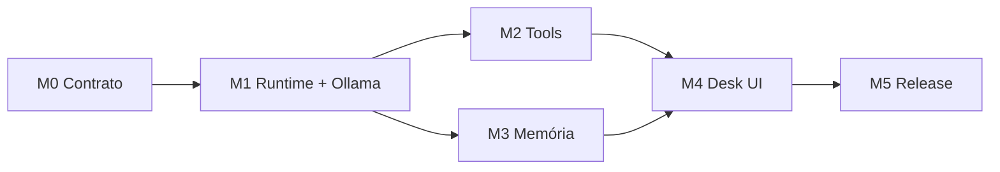

# Linear — Setup completo Open Polvo Desk MVP v0.1

Guia para **zerar o board antigo** do projecto Open Polvo e recriar tudo — do milestone à sub-issue — até chegar ao MVP descrito em [`open-polvo-desk-mvp-prompt.md`](open-polvo-desk-mvp-prompt.md).

---

## Visão geral (o que vais criar)

```
Workspace Linear
└── Team: Open Polvo                    ← mantém 1 team (MVP pequeno)
    └── Project: Open Polvo Desk MVP v0.1
        ├── Milestones M0 → M5           ← 6 marcos temporais
        ├── 7 Epics (parent issues)      ← 1 por camada + release
        ├── 30 Issues                    ← entregáveis verificáveis
        └── ~45 Sub-issues               ← tarefas de 2–8h cada
```

**Total:** 6 milestones · 7 epics · 30 issues · ~45 sub-issues.

---

## Parte 1 — Zerar o projecto antigo (sem perder histórico)

### Opção A — Recomendada: arquivar e projecto novo

1. Abre o projecto **Open Polvo** existente no Linear.
2. Selecciona todas as issues abertas → **Bulk edit** → Estado **Canceled** ou **Archived** (conforme o teu workflow).
3. Adiciona label `legacy-pre-desk` às issues antigas (filtro futuro).
4. No projecto antigo: renomeia para **`Open Polvo (legacy)`** e marca como **Paused/Completed**.
5. Cria **projecto novo**: **`Open Polvo Desk MVP v0.1`**.

### Opção B — Reutilizar o mesmo projecto

1. Cancela/arquiva **todas** as issues existentes.
2. Renomeia o projecto para **`Open Polvo Desk MVP v0.1`**.
3. Apaga milestones antigos; crias os 6 novos (secção 4).

> **Não apagues** issues antigas se já tiverem PRs/commits ligados — arquivar preserva rastreabilidade.

---

## Parte 2 — Configuração do Team

Usa **um único team** `Open Polvo` (equipa pequena = menos fricção). Diferencia camadas por **labels**, não por teams.

### Workflow (colunas)

| Estado | Significado |
|--------|-------------|
| **Backlog** | Planeado, não iniciado |
| **Ready** | Critérios claros, pode começar |
| **In Progress** | Em desenvolvimento |
| **In Review** | PR aberto / gate a correr |
| **Done** | Aceite + merge |
| **Canceled** | Fora de scope v0.1 |

### Labels (criar todas)

**Camada (obrigatória em cada issue):**
- `layer-core` · `layer-model` · `layer-tools` · `layer-memory` · `layer-desk` · `layer-release`

**Stack:**
- `stack-intelligence` · `stack-backend` · `stack-frontend` · `stack-docs` · `stack-all`

**Tipo:**
- `type-epic` · `type-feature` · `type-fix` · `type-chore`

**MVP:**
- `mvp-v0.1` (todas as issues do projecto)
- `out-of-scope` (ideias futuras — **não** entram neste projecto)
- `baseline-exists` (código parcial já no repo — começar de Ready)

**Prioridade implícita:** usa o campo Priority do Linear (Urgent / High / Medium / Low).

---

## Parte 3 — Criar o Projecto

| Campo | Valor |
|-------|-------|
| **Nome** | Open Polvo Desk MVP v0.1 |
| **Status** | In Progress |
| **Target date** | +6 semanas a partir de hoje |
| **Lead** | _(tu)_ |

**Descrição** (colar):

```markdown
Primeira versão utilizável do Open Polvo Desk — agente local com LangGraph,
tools (filesystem, terminal, git) e UI desktop simples (Agent / Code / Flow stub).

Spec: `docs/open-polvo-desk-mvp-prompt.md`
Mapa código↔cards: `.cursor/skills/linear-desk-mvp-sync/linear-issues-map.md`

## Invariantes
- Runtime Desk = grafo LangGraph (`desk_graph`), sem loop imperativo
- Ollama default; OpenAI/Anthropic opcionais
- Sem multiagente, RAG, marketplace, cloud, domínios Zé Polvinho no MVP

## Aceite v0.1
1. Ollama responde sem cloud
2. "lista ficheiros src/" → tool filesystem OK
3. "git status" → output real
4. Reiniciar app → conversa + memória OK
5. Agent Mode mostra logs de tools
6. Tag `desk-v0.1.0`
```

---

## Parte 4 — Milestones (6)

Cria nesta ordem. Ajusta datas ao teu calendário.

| # | Nome | Target | Critério de aceite (colar na descrição) |
|---|------|--------|------------------------------------------|
| **M0** | Contrato & bootstrap | Semana 1 | 3 stacks sobem; 1 conversa sem tools; `desk_context` no schema |
| **M1** | Runtime LangGraph + Ollama | Semana 2 | `desk_graph` compilado; 1 tool mock via nó `tools`; Ollama no `/readyz` |
| **M2** | Tools locais | Semana 3 | fs + terminal + git num repo de teste |
| **M3** | Memória | Semana 4 | Histórico + memória workspace entre sessões |
| **M4** | Desk UI | Semana 5 | Agent Mode utilizável; Code enxuto; Flow shell |
| **M5** | Release v0.1 | Semana 6 | Smoke E2E + instalador + tag `desk-v0.1.0` |

---

## Parte 5 — Hierarquia completa (Epic → Issue → Sub-issue)

Legenda:
- **Epic** = parent issue com label `type-epic`
- **Issue** = filho directo do epic
- **Sub-issue** = filho da issue (trabalho de 2–8h)
- **Deps** = blocked by (criar link no Linear)

Estado actual do repo (Jun 2025): itens com tag `baseline-exists` já têm código parcial — começam em **Ready**, não Backlog.

---

### M0 — Contrato & bootstrap

#### Epic `M0-EPIC` — Contrato & bootstrap
Labels: `layer-desk`, `stack-all`, `type-epic`, `mvp-v0.1`  
Milestone: **M0**

---

##### Issue `DESK-0` — Congelar schema reply/stream MVP
Labels: `layer-desk`, `stack-all`, `type-feature`  
Paths: `openpolvobackend/internal/agent/**`, `openpolvointeligence/api/**`

**Descrição:**
Congelar contrato HTTP mínimo entre as 3 stacks. Remover/ignorar payloads de domínios Zé Polvinho (finance, meta, smtp, etc.) quando `desk_context` presente.

**Aceite:**
- [ ] Body documentado com `desk_context.mode`, `workspace_path`, `conversation_id`
- [ ] SSE: `delta`, `agent_event`, `done`
- [ ] Schemas pydantic + Go struct alinhados
- [ ] Teste contract sem LLM

**Sub-issues:**

| ID | Título | Stack |
|----|--------|-------|
| DESK-0.1 | Schema pydantic `DeskContext` + `AgentEvent` em `api/schemas.py` | intelligence |
| DESK-0.2 | Go: struct `DeskContext` no adapter agent + pass-through stream | backend |
| DESK-0.3 | Documentar contrato em `docs/desk-api-contract.md` | docs |
| DESK-0.4 | Teste pytest schema + teste Go serialização JSON | all |

---

##### Issue `DESK-1` — Flag `DESK_MVP_MODE`
Labels: `layer-desk`, `stack-frontend`, `type-feature`  
Paths: `polvocode/src/vs/workbench/contrib/polvoModes/**`

**Descrição:**
Com `DESK_MVP_MODE=true` (env Vite), ocultar sidebar/routes: finanças, social, meta, automações, pulo do gato. Landing = Desk shell.

**Aceite:**
- [ ] `.env.example` documenta flag
- [ ] Rotas legacy inacessíveis na UI
- [ ] Chat + settings mínimos visíveis

**Sub-issues:**

| ID | Título |
|----|--------|
| DESK-1.1 | Env `VITE_DESK_MVP_MODE` + helper `isDeskMvpMode()` |
| DESK-1.2 | Filtrar items sidebar / navegação |
| DESK-1.3 | Redirect `/` → workspace Desk quando flag activa |

---

##### Issue `DESK-2` — Documentar arranque local MVP
Labels: `layer-desk`, `stack-docs`, `type-chore`  
Paths: `README`, `AGENTS.md`

**Aceite:**
- [ ] 3 terminais, < 2 min
- [ ] Ollama mencionado como provider default
- [ ] Link para spec MVP

**Sub-issues:**

| ID | Título |
|----|--------|
| DESK-2.1 | Secção `docs/desk-mvp-quickstart.md` |
| DESK-2.2 | Referência no README raiz + polvocode |

---

### M1 — Runtime LangGraph + Ollama

#### Epic `CORE-0` — Runtime Core — grafo LangGraph Desk
Labels: `layer-core`, `stack-intelligence`, `type-epic`  
Milestone: **M1**  
Blocked by: **DESK-0** (contrato)

---

##### Issue `CORE-1` — `desk_state.py` — DeskAgentState
Label: `baseline-exists` (padrão em `dev_workflow_state.py`)

**Aceite:**
- [ ] TypedDict com messages, iteration, max_iterations, trace, workspace_path, desk_context, assistant_text, metadata
- [ ] Helper `truncate_trace` reutilizado ou espelhado

**Sub-issues:**

| ID | Título |
|----|--------|
| CORE-1.1 | Definir `DeskAgentState` + campos obrigatórios |
| CORE-1.2 | Testes unitários campos default / merge partial |

---

##### Issue `CORE-2` — `desk_graph.py` — build_desk_graph
Blocked by: **CORE-1**

**Aceite:**
- [ ] `build_desk_graph(settings)` retorna grafo compilado
- [ ] Topologia: START → load_context → agent → (tools|finalize) → END

**Sub-issues:**

| ID | Título |
|----|--------|
| CORE-2.1 | Esqueleto StateGraph + wiring START/END |
| CORE-2.2 | Registar nós load_context, agent, tools, finalize |
| CORE-2.3 | Conditional edge `should_continue_tools(state)` |
| CORE-2.4 | Teste compilação grafo sem LLM |

---

##### Issue `CORE-3` — Implementar nós do grafo
Blocked by: **CORE-2**

**Sub-issues:**

| ID | Título |
|----|--------|
| CORE-3.1 | Nó `load_context` (trim msgs, memória — stub OK) |
| CORE-3.2 | Nó `agent` — LLM + bind_tools + AIMessage |
| CORE-3.3 | Nó `tools` — dispatch registry (mock tool primeiro) |
| CORE-3.4 | Nó `finalize` — assistant_text + metadata + trace |
| CORE-3.5 | `prompts/desk_agent_system.md` |
| CORE-3.6 | Testes nós com state fixture (sem LLM real) |

---

##### Issue `CORE-4` — run_desk_reply / run_desk_reply_stream + routing
Label: `baseline-exists` (`zepolvinho_graph.run_reply_stream`)  
Blocked by: **CORE-2**, **DESK-0**

**Sub-issues:**

| ID | Título |
|----|--------|
| CORE-4.1 | `desk_routing.should_use_desk_graph(desk_context)` |
| CORE-4.2 | `run_desk_reply` + `run_desk_reply_stream` |
| CORE-4.3 | Integrar rota `/v1/reply/stream` quando desk_context |
| CORE-4.4 | Teste routing + invoke mock |

---

##### Issue `CORE-5` — SSE agent_event por nó LangGraph
Blocked by: **CORE-4**

**Sub-issues:**

| ID | Título |
|----|--------|
| CORE-5.1 | Emitir eventos `graph_step`, `tool_call`, `tool_result` no stream |
| CORE-5.2 | Backend Go repassa SSE sem alterar shape |
| CORE-5.3 | Teste integração stream (mock graph) |

---

#### Epic `MODEL-0` — Model Layer — providers
Milestone: **M1**

---

##### Issue `MODEL-1` — Provider Ollama
Label: `baseline-exists` (OpenAI/Google em models.py)

**Sub-issues:**

| ID | Título |
|----|--------|
| MODEL-1.1 | Config: `OLLAMA_BASE_URL`, `OLLAMA_MODEL` |
| MODEL-1.2 | `ChatOllama` em `get_chat_model(provider="ollama")` |
| MODEL-1.3 | Teste unitário factory (mock) |

---

##### Issue `MODEL-2` — Health Ollama + effective_provider

**Sub-issues:**

| ID | Título |
|----|--------|
| MODEL-2.1 | `/readyz` inclui check Ollama reachable |
| MODEL-2.2 | `effective_provider` aceita `ollama` |
| MODEL-2.3 | Desk default provider = ollama na config |

---

##### Issue `MODEL-3` — OpenAI/Anthropic opcionais (flags)

**Sub-issues:**

| ID | Título |
|----|--------|
| MODEL-3.1 | Flag env `DESK_ALLOW_CLOUD_PROVIDERS` |
| MODEL-3.2 | Anthropic em `get_chat_model` (se key presente) |
| MODEL-3.3 | UI settings: esconder cloud se flag off |

---

### M2 — Tools locais

#### Epic `TOOL-0` — Tools Layer — locais
Milestone: **M2**  
Blocked by: **CORE-3** (nó tools)

---

##### Issue `TOOL-1` — Tool filesystem
Label: `baseline-exists` (`polvoCode.cjs`)

**Sub-issues:**

| ID | Título |
|----|--------|
| TOOL-1.1 | Schema JSON `filesystem_read`, `filesystem_list`, `filesystem_write` |
| TOOL-1.2 | Handler em `desk_tool_logic.py` |
| TOOL-1.3 | Integração IPC polvoCode (read/list/write) |
| TOOL-1.4 | Teste path traversal bloqueado |

---

##### Issue `TOOL-2` — Tool terminal

**Sub-issues:**

| ID | Título |
|----|--------|
| TOOL-2.1 | IPC `deskTerminal.run` no Electron |
| TOOL-2.2 | Denylist + timeout 60s + cwd workspace |
| TOOL-2.3 | Schema + handler `terminal_run` |
| TOOL-2.4 | Teste comando benigno (`echo ok`) |

---

##### Issue `TOOL-3` — Tool git

**Sub-issues:**

| ID | Título |
|----|--------|
| TOOL-3.1 | IPC `deskGit.cjs` — status, diff |
| TOOL-3.2 | Commit behind flag `DESK_GIT_ALLOW_COMMIT` |
| TOOL-3.3 | Schema + handler no nó tools |
| TOOL-3.4 | Teste git status em repo fixture |

---

##### Issue `TOOL-4` — Bridge intelligence ↔ desktop
Labels: `stack-all`

**Sub-issues:**

| ID | Título |
|----|--------|
| TOOL-4.1 | Go handler valida sessão + workspace_path |
| TOOL-4.2 | Frontend executa IPC e devolve resultado ao stream |
| TOOL-4.3 | Modal aprovação comandos perigosos (terminal) |
| TOOL-4.4 | E2E mock: tool_call → IPC → tool_result |

---

### M3 — Memória

#### Epic `MEM-0` — Memory Layer — básica
Milestone: **M3**  
Blocked by: **CORE-3.1** (load_context)

---

##### Issue `MEM-1` — Histórico conversa MVP
Label: `baseline-exists`

**Sub-issues:**

| ID | Título |
|----|--------|
| MEM-1.1 | Backend passa messages sem contextos Zé Polvinho |
| MEM-1.2 | Frontend envia só messages + desk_context |

---

##### Issue `MEM-2` — Memória global + workspace
Label: `baseline-exists` (`agent_memory_patch.go`)

**Sub-issues:**

| ID | Título |
|----|--------|
| MEM-2.1 | Renomear/alias `builder` → `workspace` no domain |
| MEM-2.2 | Patch metadata `agent_memory_patch` no fluxo Desk |
| MEM-2.3 | Migração SQLite se necessário (ou alias só) |

---

##### Issue `MEM-3` — Nó load_context com memória

**Sub-issues:**

| ID | Título |
|----|--------|
| MEM-3.1 | Inject `format_agent_memory_block` no system prompt |
| MEM-3.2 | Teste nó com memória fixture |

---

##### Issue `MEM-4` — Trim mensagens (últimas N)
Label: `baseline-exists` (`message_utils`)

**Sub-issues:**

| ID | Título |
|----|--------|
| MEM-4.1 | `tail_messages` N=20 no load_context |
| MEM-4.2 | Truncar memória a ~4k tokens (chars) |

---

### M4 — Desk UI

#### Epic `DESK-EPIC` — Open Polvo Desk — shell UI
Milestone: **M4**  
Blocked by: **CORE-5**, **TOOL-4**

---

##### Issue `DESK-10` — Shell Code / Agent / Flow

**Sub-issues:**

| ID | Título |
|----|--------|
| DESK-10.1 | Layout `src/desk/DeskShell.tsx` + tabs |
| DESK-10.2 | Estado global mode (agent/code/flow) |
| DESK-10.3 | Integrar no WorkspacePage quando MVP mode |

---

##### Issue `DESK-11` — Agent Mode — chat + logs
Label: `baseline-exists` (ChatPanel)

**Sub-issues:**

| ID | Título |
|----|--------|
| DESK-11.1 | Chat envia desk_context no payload |
| DESK-11.2 | `AgentLogPanel` lista agent_events |
| DESK-11.3 | Collapse/expand por tool call |

---

##### Issue `DESK-12` — Code Mode — DevStudio enxuto
Label: `baseline-exists`

**Sub-issues:**

| ID | Título |
|----|--------|
| DESK-12.1 | Embutir DevStudioPanel sem rotas legacy |
| DESK-12.2 | Esconder acções não-MVP (se houver) |

---

##### Issue `DESK-13` — Flow Mode placeholder

**Sub-issues:**

| ID | Título |
|----|--------|
| DESK-13.1 | `FlowModeShell.tsx` — mensagem "Em breve" |
| DESK-13.2 | Tab desactivada opcional hover tooltip |

---

##### Issue `DESK-14` — Selector workspace + modelo

**Sub-issues:**

| ID | Título |
|----|--------|
| DESK-14.1 | Picker pasta (reutilizar chooseProjectFolder) |
| DESK-14.2 | Dropdown provider (Ollama default) |
| DESK-14.3 | Persistir escolha por conversa |

---

##### Issue `DESK-15` — Painel logs agente (SSE)
Blocked by: **DESK-11**, **CORE-5**

**Sub-issues:**

| ID | Título |
|----|--------|
| DESK-15.1 | Parser SSE `agent_event` no client |
| DESK-15.2 | Timeline thought → tool → observation |
| DESK-15.3 | Auto-scroll + clear |

---

### M5 — Release v0.1

#### Epic `REL-0` — Release v0.1
Milestone: **M5**  
Blocked by: todos os epics M0–M4

---

##### Issue `REL-1` — Smoke test E2E

**Checklist (colar na issue):**
- [ ] Arranque 3 stacks
- [ ] Ollama sem cloud
- [ ] "lista ficheiros src/"
- [ ] "git status"
- [ ] Reinício → memória OK
- [ ] Logs visíveis no Agent Mode

---

##### Issue `REL-2` — Build desktop + tag

**Sub-issues:**

| ID | Título |
|----|--------|
| REL-2.1 | `build-desktop-artifacts.ps1` com DESK_MVP_MODE |
| REL-2.2 | Tag git `desk-v0.1.0` |
| REL-2.3 | GitHub release notes |

---

##### Issue `REL-3` — README MVP + changelog

**Sub-issues:**

| ID | Título |
|----|--------|
| REL-3.1 | `CHANGELOG.md` entrada v0.1.0 |
| REL-3.2 | README focado Desk (não Zé Polvinho completo) |

---

## Parte 6 — Dependências entre epics (diagrama)



**Ordem de execução recomendada (issues):**

1. DESK-0 → DESK-1 → DESK-2 *(paralelo após DESK-0)*
2. CORE-1 → CORE-2 → CORE-3 → CORE-4 → CORE-5
3. MODEL-1 → MODEL-2 *(paralelo com CORE-2+)*
4. MODEL-3 *(opcional, baixa prioridade)*
5. TOOL-1 → TOOL-4; TOOL-2 + TOOL-3 *(paralelo)*
6. MEM-1 → MEM-2 → MEM-3 → MEM-4
7. DESK-10 → DESK-14 → DESK-11 → DESK-15 → DESK-12 → DESK-13
8. REL-1 → REL-2 → REL-3

---

## Parte 7 — Criar no Linear (passo a passo UI)

### 7.1 Bulk create (manual, ~1h)

1. **Project** → criar conforme Parte 3.
2. **Milestones** → 6 entradas (Parte 4).
3. Para cada **Epic** (Parte 5):
   - New issue → título `[Epic] M0 — Contrato & bootstrap`
   - Label `type-epic` + milestone M0
4. Para cada **Issue** filha:
   - New issue → título exacto (ex. `DESK-0 — Congelar schema reply/stream MVP`)
   - **Parent** = epic correspondente
   - Labels camada + stack + `mvp-v0.1`
   - Colar descrição + aceite da Parte 5
5. Para cada **Sub-issue**:
   - New issue → título `DESK-0.1 — Schema pydantic...`
   - **Parent** = issue DESK-0
   - Estimate: 2–8h cada

### 7.2 Views úteis

| View | Filtro |
|------|--------|
| **Board MVP** | Project = Desk MVP v0.1 |
| **Por milestone** | Group by Milestone |
| **Ready to start** | State = Ready |
| **Só Intelligence** | Label `stack-intelligence` |
| **Baseline** | Label `baseline-exists` |

### 7.3 Campos opcionais

- **Estimate**: sub-issues 2–8h; issues 1–3 dias; epics 1 semana
- **Git branch**: `feat/DESK-0-schema` (comentário ao iniciar)

---

## Parte 8 — Import CSV (alternativa rápida)

Linear → Settings → Import → CSV. Cabeçalho mínimo:

```csv
Title,Description,Priority,Labels,Parent,Milestone
"[Epic] M0 — Contrato & bootstrap","Epic M0",High,"type-epic,layer-desk,mvp-v0.1",,M0
"DESK-0 — Congelar schema reply/stream MVP","Ver docs/linear-desk-mvp-setup.md",Urgent,"layer-desk,stack-all,mvp-v0.1","[Epic] M0 — Contrato & bootstrap",M0
"DESK-0.1 — Schema pydantic DeskContext","api/schemas.py",High,"stack-intelligence,mvp-v0.1","DESK-0 — Congelar schema reply/stream MVP",M0
```

Repete o padrão para todas as linhas da Parte 5. Depois do import, corrige parents que o CSV não resolveu.

---

## Parte 9 — Sincronizar com o repo

Após criar no Linear:

1. Copia cada **Issue ID** Linear (ex. `OP-142`) para [linear-issues-map.md](../.cursor/skills/linear-desk-mvp-sync/linear-issues-map.md).
2. A skill `linear-desk-mvp-sync` passa a actualizar cards automaticamente em feat/fix/push.

---

## Parte 10 — O que NÃO criar

Não cries issues para (marca `out-of-scope` noutro projecto/backlog futuro):

- Multiagente / dev_workflow teams no Desk
- Code RAG / pgvector
- Marketplace / plugins
- Cloud sync
- Finanças, social, email, CRON Zé Polvinho
- Knowledge graph
- Loop imperativo fora LangGraph

---

## Resumo numérico

| Nível | Quantidade |
|-------|------------|
| Milestones | 6 |
| Epics | 7 |
| Issues | 30 |
| Sub-issues | ~45 |
| **Total cards** | **~82** |

Tempo estimado setup Linear: **1–2 horas** (UI manual) ou **30 min** (CSV + ajustes).

Depois do setup, começa por **DESK-0.1** — desbloqueia todo o resto.
