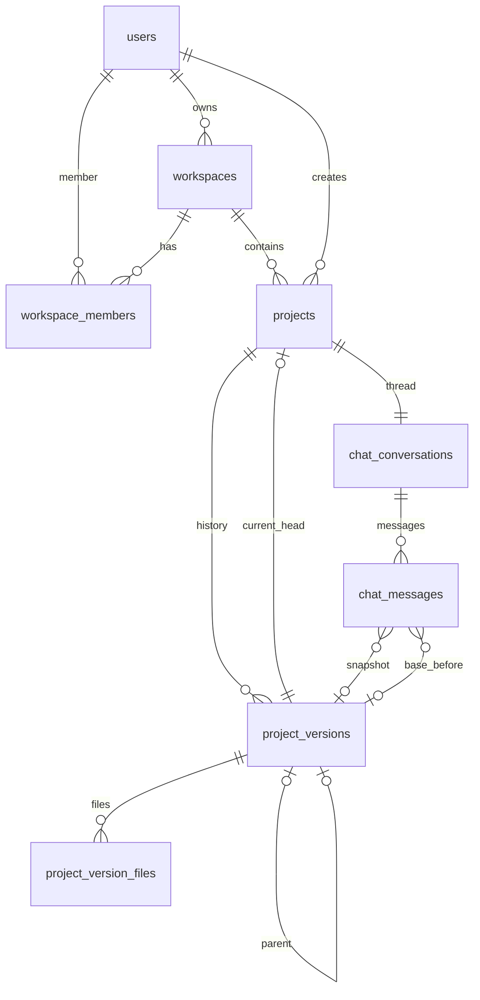

# Schema PostgreSQL — Open Polvo SaaS (Lovable BR)

Modelo multi-tenant para **utilizadores → workspaces → projectos → versões (Git-like) → chat com snapshot**.

## Diagrama ER



## Tabelas

| Tabela | Função |
|--------|--------|
| `users` | Conta SaaS (email, plano, locale pt-BR) |
| `workspaces` | Organização / conta pessoal — vários projectos |
| `workspace_members` | Equipa (owner, admin, editor, viewer) |
| `projects` | App gerado no estúdio; `current_version_id` = HEAD |
| `project_versions` | Snapshot imutável (#1, #2, …); `parent_version_id` = linhagem Git |
| `project_version_files` | Conteúdo path→texto por versão |
| `chat_conversations` | Thread 1:1 com projecto |
| `chat_messages` | Prompts/respostas; `project_version_id` = código naquele momento |

## Índices para histórico de prompts

- `(project_id, created_at)` — timeline do projecto
- `(project_id, role, created_at) WHERE role = 'user'` — só prompts
- `(conversation_id, created_at)` — replay do chat
- `(author_user_id, created_at)` — actividade por utilizador
- `GIN(content_tsv)` — full-text português
- `GIN(content gin_trgm_ops)` — busca fuzzy

## Rollback

```sql
SELECT rollback_project_to_version(
  '<project_id>'::UUID,
  '<version_id_alvo>'::UUID,
  '<user_id>'::UUID,
  'Reverter para versão antes do PDF'
);
```

Cria uma **nova** versão (`source = rollback`) copiando ficheiros — histórico nunca se perde.

## Aplicar

```bash
psql "$DATABASE_URL" -f openpolvobackend/schema/postgres/001_lovable_saas.up.sql
```

## Prisma

Ver `openpolvobackend/prisma/schema.prisma`.

```bash
cd openpolvobackend/prisma
DATABASE_URL="postgresql://..." npx prisma db push
```

## Supabase

1. Substituir `users.id` por `REFERENCES auth.users(id)`.
2. Activar RLS em `projects`, `chat_messages`, etc. filtrando por `workspace_members`.
3. Copiar SQL para `supabase/migrations/YYYYMMDDHHMMSS_lovable_saas.sql`.

## Relação com MySQL actual

O backend Go actual (`openpolvobackend/migrations/`) usa MySQL/SQLite com `laele_users` e `laele_messages` (chat genérico). Este schema PostgreSQL é a **evolução SaaS** para projectos versionados no estúdio — migrar quando adoptarem Postgres/Supabase.
